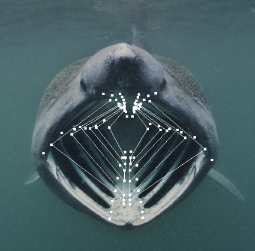
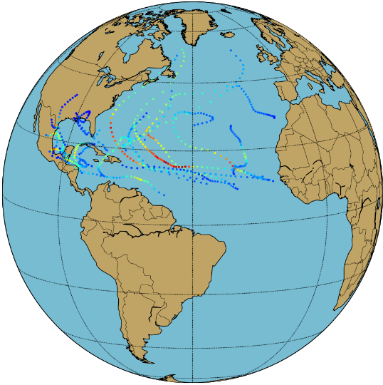

# Advanced

Here you can find advanced demos (jupyter notebooks) of real-world applications and further geometric tools that are based on Morphomatics.

|                                                                                             |                                                                                                                                                        |
|:-------------------------------------------------------------------------------------------:|:-------------------------------------------------------------------------------------------------------------------------------------------------------|
|              | [__Reconstructing the 3D shapes of basking shark head skeletons from single monocular 2D images__](https://github.com/morphomatics/3Dfrom2DLandmarks) |
|   | [__Statistical Analysis of Hurricane Tracks using Bézierfold with a Sasakian metric__](https://github.com/morphomatics/GeometricHurricaneAnalysis)    |